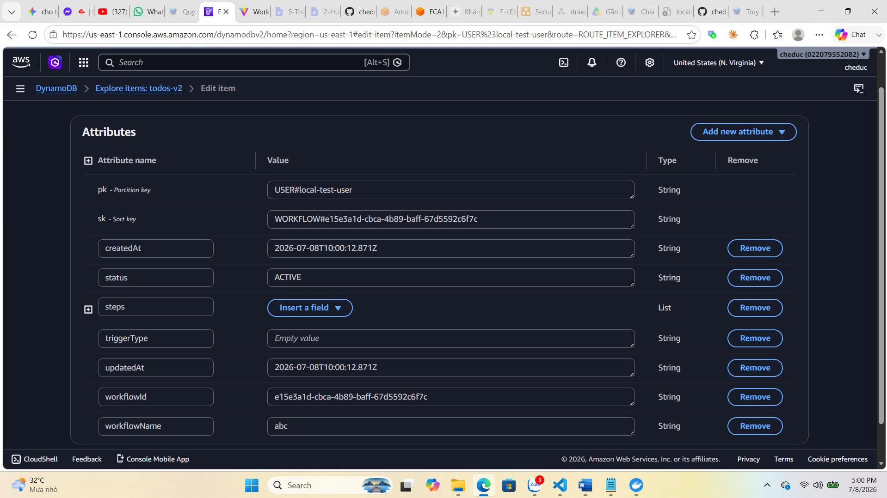
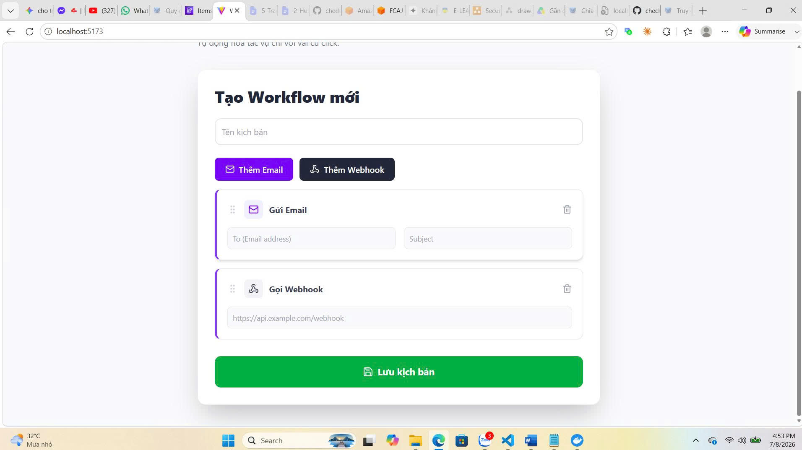
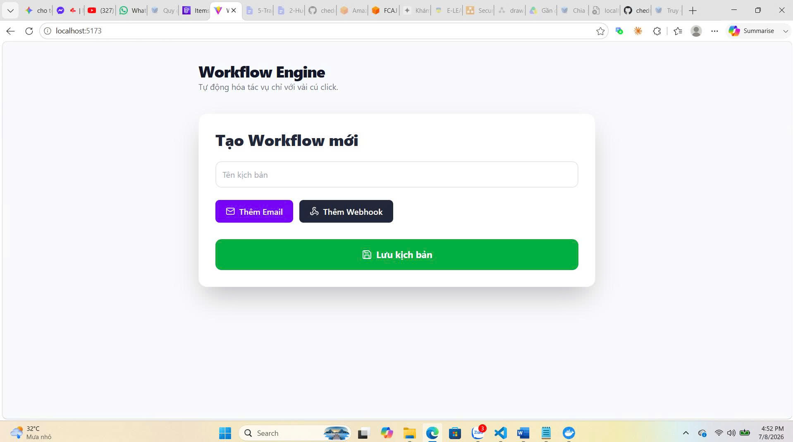

# Serverless Todo API - Đề Xuất Dự Án

---

## 1. Tổng quan Dự án

**Tên Dự án**: Ứng dụng Todo Serverless API  
**Thời lượng**: 12 tuần (17/04 - 09/07/2026)  
**Thực tập sinh**: Phan Nguyễn Như Thành  

### Dự án là gì?

Một hệ thống quản lý Todo hiện đại, có thể mở rộng được xây dựng hoàn toàn trên các dịch vụ serverless của AWS. Người dùng có thể tạo, xem, cập nhật và xóa các công việc thông qua REST API, rất phù hợp để học kiến trúc AWS và các best practice.






---

## 2. Vấn đề Cần Giải Quyết

### Thách Thức Hiện Tại
- Ứng dụng truyền thống dựa trên máy chủ đòi hỏi phải quản lý liên tục
- Thách thức về khả năng mở rộng (scaling) với hạ tầng cố định
- Chi phí vận hành cao do tài nguyên máy chủ nhàn rỗi
- Khó tiếp cận và học hỏi kiến trúc Cloud-Native

### Giải Pháp
Xây dựng giải pháp Serverless đáp ứng:
- Không cần quản lý máy chủ vật lý hay máy chủ ảo
- Tự động mở rộng theo nhu cầu thực tế
- Chi phí tối ưu, chỉ trả cho lượng sử dụng thực tế
- Minh họa chuẩn mực các best practices của AWS

---

## 3. Mục Tiêu Dự Án

### Mục Tiêu Chính
1. **Học AWS Services**: Thực hành chuyên sâu với Lambda, DynamoDB, API Gateway, Cognito, SES.
2. **Viết Code Chuyên Nghiệp**: Mã nguồn sạch, dễ bảo trì và mở rộng.
3. **Hiểu Kiến Trúc Serverless**: Nắm rõ thời điểm và phương pháp áp dụng Serverless hiệu quả.
4. **Triển Khai Bảo Mật**: Áp dụng nguyên tắc phân quyền tối thiểu (Least Privilege) với IAM và JWT Auth.
5. **Giám Sát & Xử Lý Lỗi**: Sử dụng Amazon CloudWatch để nâng cao tính khả quan (Observability).

### Kết Quả Đo Lường Được
- Hoàn thiện trọn bộ CRUD API với đầy đủ endpoints hoạt động ổn định.
- Không phát sinh lỗi trong hơn 100+ requests thử nghiệm.
- Thời gian phản hồi trung bình < 100ms.
- Bộ tài liệu hướng dẫn triển khai hoàn chỉnh.
- Chi phí tối ưu trên hạ tầng AWS.

---

## 4. Kiến Trúc Giải Pháp

```
                          [Clients]
                              ↓
                   [API Gateway]
                   (REST endpoints)
                              ↓
        ┌─────────────────────┼─────────────────────┐
        ↓                      ↓                      ↓
  [CreateTodo]          [GetTodos]          [UpdateTodo/Delete]
  (Lambda Function)     (Lambda Function)   (Lambda Function)
        ↓                      ↓                      ↓
        └─────────────────────┼─────────────────────┘
                              ↓
                       [DynamoDB Table]
                       (todos - Data Store)
                              ↓
                       [CloudWatch Logs]
                       (Monitoring)
```

### Dịch Vụ AWS Cốt Lõi

| Dịch Vụ | Mục Đích | Lý Do Chọn |
|---------|----------|----------|
| **API Gateway** | Quản lý REST API endpoints | Được quản lý hoàn toàn, dễ mở rộng, tích hợp tốt |
| **AWS Lambda** | Thực thi logic kinh doanh | Chi phí theo lượt dùng, tự động scale |
| **DynamoDB** | Lưu trữ dữ liệu NoSQL | Quản lý hoàn toàn, khả năng mở rộng vô hạn |

---

## 5. Timeline Dự Án

### Giai Đoạn 1: Thiết lập & Nền tảng (Tuần 1-5) ✅
- Cấu hình tài khoản AWS, CLI, IAM Roles và VPC.
- Khởi tạo cơ sở dữ liệu thử nghiệm (RDS & DynamoDB).

### Giai Đoạn 2: Phát Triển Serverless API (Tuần 6-10) ✅
- Phát triển các hàm Lambda (Create/Read/Update/Delete Todo).
- Cấu hình API Gateway, Cognito Authorizer & SES Notifications.
- Tích hợp Frontend UI tĩnh với AWS S3 & CloudFront.

### Giai Đoạn 3: Tự Động Hóa & Báo Cáo (Tuần 11-12) ✅
- Xây dựng CI/CD Pipeline với GitHub Actions & AWS SAM.
- Kiểm thử tải (Load Testing) bằng Artillery & hoàn thiện báo cáo thực tập.

---

## 6. Tiêu Chí Thành Công

✅ **Chức Năng**
- Đầy đủ các endpoints CRUD hoạt động mượt mà.
- 100% test pass rate.
- Response time trung bình < 100ms.

✅ **Bảo Mật & Giám Sát**
- Phân quyền IAM Least Privilege.
- Xác thực người dùng bằng JWT Token via Cognito.
- Giám sát nhật ký chi tiết qua CloudWatch Logs.

✅ **Tài Liệu & Chi Phí**
- Bộ tài liệu song ngữ (Việt / Anh).
- Hướng dẫn triển khai chi tiết từng bước.
- Chi phí tối ưu trong hạn mức AWS Free Tier.

---

**Trạng Thái Dự Án**: ✅ Phê Duyệt & Hoàn Thành Triển Khai