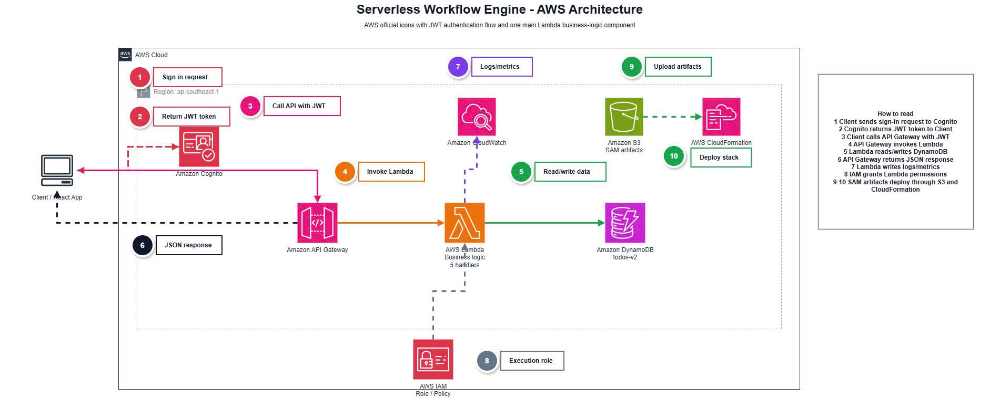

# Serverless Todo API - Đề Xuất Dự Án

---

## 1. Tổng quan Dự án

**Tên Dự án**: Ứng dụng Todo Serverless API  
**Thời lượng**: 12 tuần (17/04 - 19/07/2026)  
**Thực tập sinh**: Nguyễn Chí Thanh  
**Trường**: Đại học Công Nghệ TP.HCM (HUTECH)

### Dự án là gì?

Một hệ thống quản lý Todo hiện đại, có thể mở rộng được xây dựng hoàn toàn trên các dịch vụ serverless của AWS.

   

---

## 2. Vấn đề Cần Giải Quyết

### Thách Thức Hiện Tại
- Ứng dụng truyền thống cần quản lý máy chủ liên tục
- Vấn đề scaling với hạ tầng cố định
- Chi phí hoạt động cao từ tài nguyên không sử dụng
- Khó học kiến trúc cloud-native

### Giải Pháp
Xây dựng giải pháp serverless:
- Không cần quản lý máy chủ
- Tự động mở rộng theo nhu cầu
- Chi phí chỉ cho lượng sử dụng thực tế
- Minh họa best practices của AWS

---

## 3. Mục Tiêu Dự Án

### Mục Tiêu Chính
1. **Học AWS Services**: Thực hành với Lambda, DynamoDB, API Gateway
2. **Viết Code Chuyên Nghiệp**: Mã sạch, có thể bảo trì
3. **Hiểu Serverless**: Biết khi nào và cách sử dụng
4. **Triển khai Bảo mật**: Áp dụng IAM least privilege
5. **Giám sát**: Sử dụng CloudWatch

---

## 4. Kiến trúc Giải Pháp

### Dịch Vụ AWS (3 Dịch Vụ Chính)

| Dịch Vụ | Mục Đích | Lý Do Chọn |
|---------|----------|----------|
| **API Gateway** | REST API endpoints | Quản lý, scalable |
| **Lambda** | Logic kinh doanh | Pay-per-use, auto-scaling |
| **DynamoDB** | Lưu trữ dữ liệu | Managed, vô hạn |

---

## 5. Timeline Dự Án

### Giai Đoạn 1: Setup (Tuần 1-2) ✅
- AWS account, CLI
- DynamoDB table
- IAM roles

### Giai Đoạn 2: Phát Triển (Tuần 3-10) ✅
- Lambda functions
- API Gateway
- Testing
- CloudWatch

### Giai Đoạn 3: Tài liệu (Tuần 11-12) ✅
- Tài liệu song ngữ
- IaC (CloudFormation)
- Final testing

---

## 6. Tiêu Chí Thành Công

✅ **Chức năng**
- 4 endpoints CRUD hoạt động
- 100% test pass
- < 100ms response time

✅ **Tài liệu**
- Song ngữ (Việt/Anh)
- Hướng dẫn chi tiết
- Sơ đồ kiến trúc

✅ **Chi phí**
- < $1 USD

---

**Trạng thái**: ✅ Phê Duyệt Triển Khai