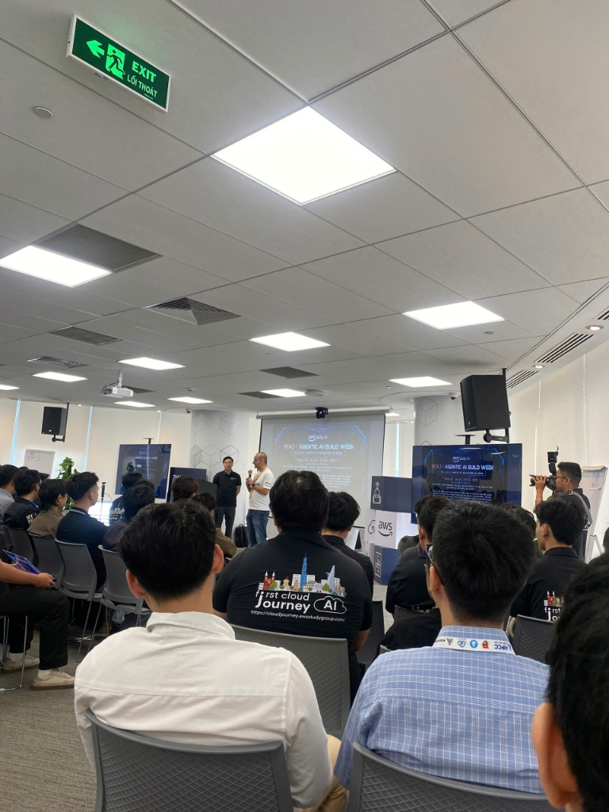
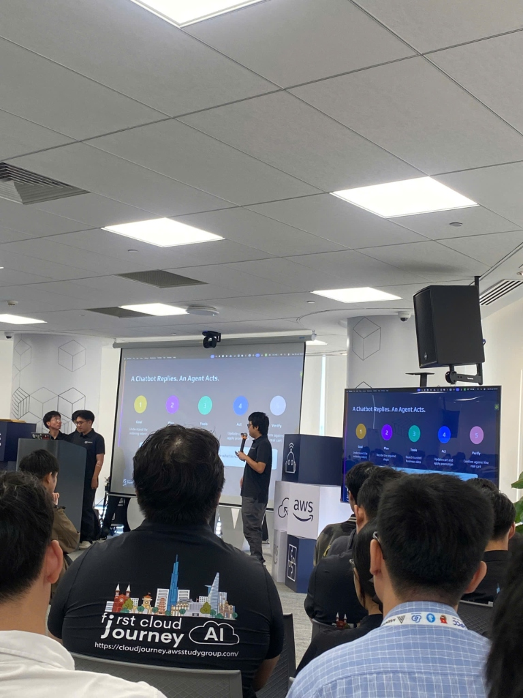
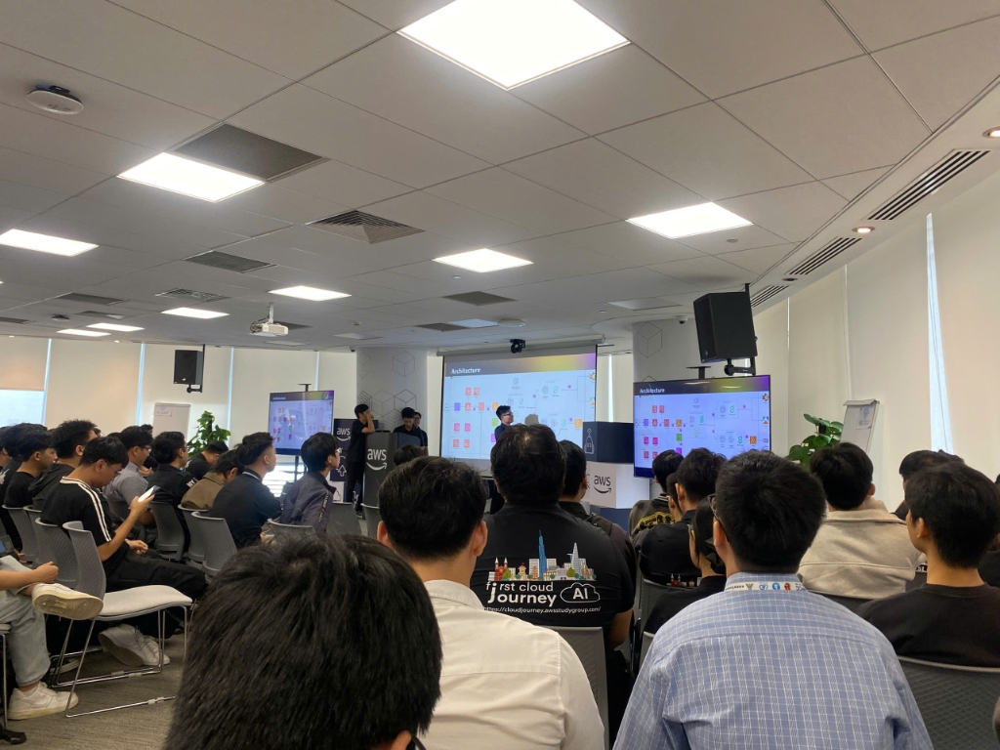
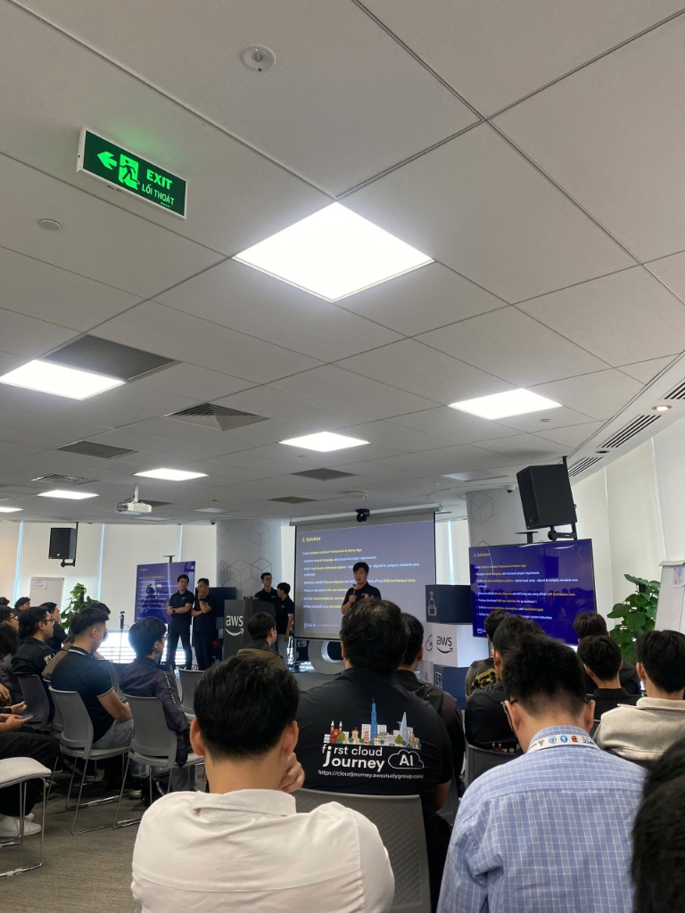
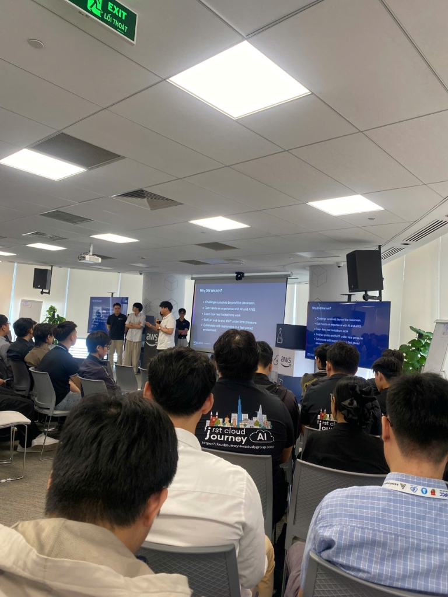

# Summary Report: "FCAJ Community Day" (Part 2)

### Event Information

| Category | Details |
| --- | --- |
| **Event Title** | FCAJ Community Day (Part 2) |
| **Date & Time** | 09:00, July 25, 2026 |
| **Location** | Floors 26 & 36, Bitexco Financial Tower, No. 02 Hai Trieu, Sai Gon Ward, Ho Chi Minh City |
| **Role** | Attendee |
| **Sessions** | 6 Technical Sessions + Opening Keynote |

---

### 1. Purpose of the Event

The **FCAJ x AABW Cloud Workshop & Community Day** focused on the central theme: **"Presenting the journey of overcoming Architectural Challenges to build complete projects for Hackathon competitions"**.

Key learning objectives included:
- **Decoding Real-World Architectural Bottlenecks**: Analyzing technical hurdles, performance bottlenecks, and design challenges faced during rapid Hackathon development.
- **AWS Solutions Optimization**: Studying how teams selected AWS services aligned with Solutions Architect (SA) principles (*Fast Development, Cost Efficiency, Auto-Scaling, and Security*).
- **System Design Mindset**: Learning the end-to-end engineering workflow: Problem Requirements ➔ Serverless/Container Selection ➔ Data Flow Design ➔ MVP Packaging.
- **Community Networking**: Connecting FCAJ Cloud interns with AWS Community Builders and industry experts.

---

### 2. Detailed Technical Analysis of Hackathon Architectural Challenges

#### 2.1. Team 3KA - "Hackathon Journey: Building a Serverless MVP in 24 Hours"
- **Architectural Challenge**: How to build a fully functional system within 24-48 hours that handles sudden traffic spikes during live judge demos while maintaining near-zero idle costs.
- **AWS Architectural Solution**:
  - Implemented an **AWS Serverless Architecture** (Amazon API Gateway + AWS Lambda + Amazon DynamoDB).
  - Eliminated server management (EC2), reducing infrastructure setup time to under 10 minutes.
  - Leveraged automatic scaling to seamlessly accommodate demo traffic bursts.

#### 2.2. OneTeam - "OneTeam Community Day: Infrastructure Automation & Collaborative Delivery"
- **Architectural Challenge**: Synchronizing workflows across Frontend, Backend, Cloud Architect, and DevOps roles under a *OneTeam* mindset, eliminating deployment bottlenecks and version conflicts.
- **AWS Architectural Solution**:
  - Adopted **Infrastructure as Code (IaC)** with Terraform to define all cloud resources declaratively.
  - Built an automated **CI/CD Pipeline** using GitHub Actions and AWS CodePipeline, enabling seamless testing and deployment to AWS within minutes of committing code.

#### 2.3. Native App Team - "SA Professional Native App: Integrating Mobile Native Apps with Cloud Backends"
- **Architectural Challenge**: Designing Native mobile apps (iOS/Android) paired with cloud backends requiring ultra-low latency, real-time data sync, and enterprise-grade authentication.
- **AWS Architectural Solution**:
  - Utilized **AWS Amplify** with **AWS AppSync (GraphQL API)** for flexible data querying and real-time synchronization.
  - Integrated **Amazon Cognito** for secure user login/signup with MFA and fine-grained IAM Roles.
  - Employed **Amazon DynamoDB** for serverless storage achieving sub-10ms response times.

#### 2.4. SignalScout Team - "SignalScout: Real-time Telemetry & Signal Stream Data Processing"
- **Architectural Challenge**: Ingesting and processing continuous, high-volume real-time sensor/telemetry data streams without system congestion or data loss.
- **AWS Architectural Solution**:
  - Built a scalable data ingestion pipeline using **Amazon Kinesis Data Streams** handling thousands of events per second.
  - Applied **AWS Lambda** for real-time event processing and data transformation.
  - Stored historical data on **Amazon S3** and generated real-time analytical dashboards.

---

### 3. Summary Matrix of Architectural Challenges & AWS Solutions

| Project Team | Primary Architectural Challenge | AWS Solution Stack | Architectural Outcome |
| --- | --- | --- | --- |
| **Team 3KA** | Rapid 24h MVP deployment & traffic spikes | AWS Lambda, API Gateway, DynamoDB (Serverless) | Setup <10 mins, auto-scaling, zero idle cost |
| **OneTeam** | Cross-functional sync & delivery bottleneck | Terraform (IaC), AWS CodePipeline, GitHub Actions | Automated CI/CD delivery under OneTeam culture |
| **SA Native App** | Mobile Native & Cloud integration, low-latency | AWS Amplify, Amazon Cognito, AppSync, DynamoDB | Real-time sync, <10ms response time, MFA security |
| **SignalScout** | High-volume real-time telemetry stream processing | Amazon Kinesis Data Streams, AWS Lambda, Amazon S3 | Non-blocking real-time stream processing pipeline |

---

### 4. Key Lessons Learned & Practical Takeaways

1. **Architectural Problem Solving**: Identifying system bottlenecks to select the optimal AWS service pattern (Serverless vs Container vs Managed Services).
2. **Solutions Architect Balance**: Balancing feature velocity, time-to-market, and the 6 Pillars of the AWS Well-Architected Framework.
3. **Internship Application**: Applying Serverless architecture and IaC/CI/CD patterns to the internship proposal and final report.

---

### 5. Event Slides & Media Archive

- **Event Architectural Slides (Google Drive):** [FCAJ Community Day Event 2 Drive Folder](https://drive.google.com/drive/folders/1goIcF8jRIGZczB4DBHGTsS6mp41FWmLL?usp=sharing)
- **Reference Documentation:** [AWS Well-Architected Framework Docs](https://aws.amazon.com/architecture/well-architected/)

---

### 6. Event Photo Gallery

